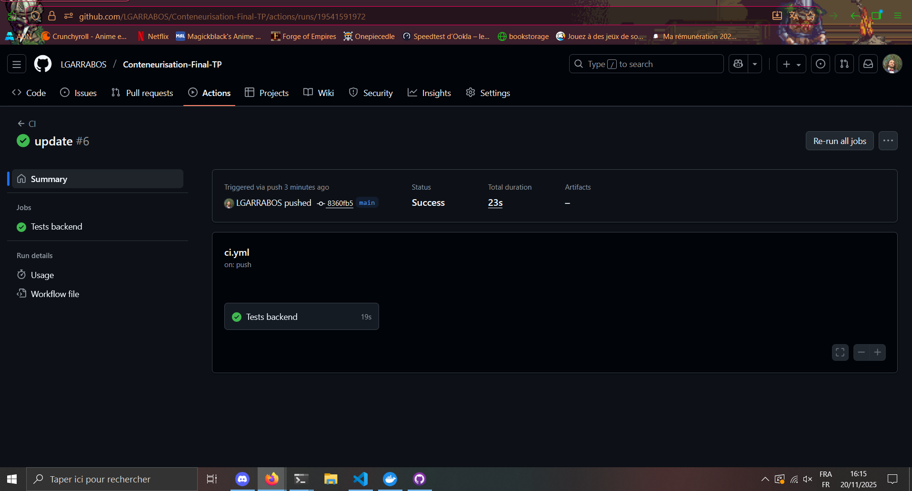
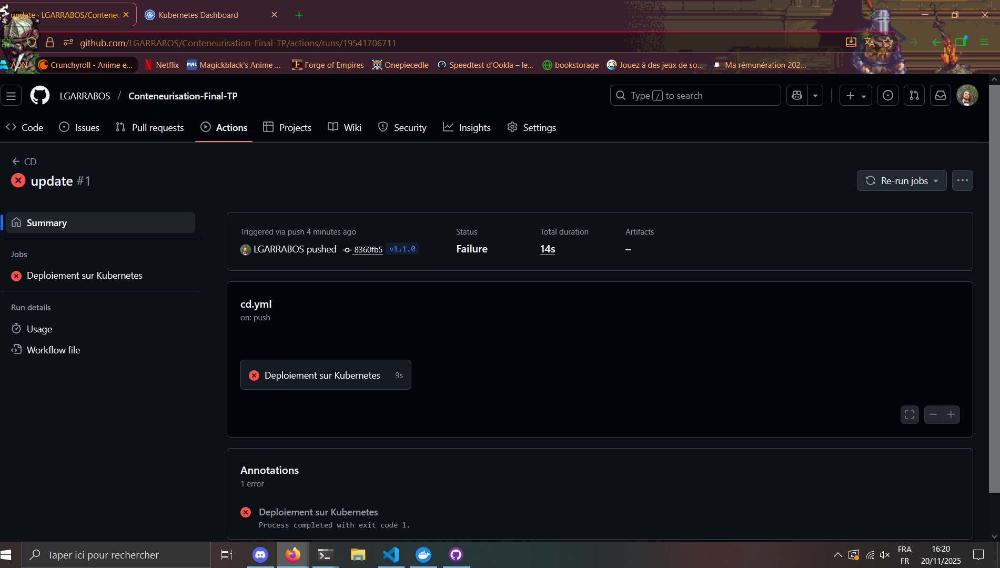

# Tp-Final

## Présentation du projet

Ce projet est une démonstration pratique de conteneurisation dans le cadre du cours de M2 à Ynov. Il met en œuvre des concepts avancés pour créer, déployer et gérer des conteneurs dans un environnement de développement.

## Documentation

Pour plus de détails, consultez les fichiers suivants :
- [Installation](./k8s/docs/architecture.md) : Architecture et choix techniques 
- [Utilisation](./k8s/docs/runbook.md) : Guide de déploiement et d'exploitation
- [Architecture](./k8s/docs/security.md) : Mesures de sécurité

## Screenshots

Note : Les captures d'écran montrent l'interface utilisateur de l'application déployée, ainsi que des exemples de configurations et de journaux système nénamoins, on voit que sur la partie cd ce n'est pas fonctionnel car le minikube étant en local il ne pet pas joindre github. 