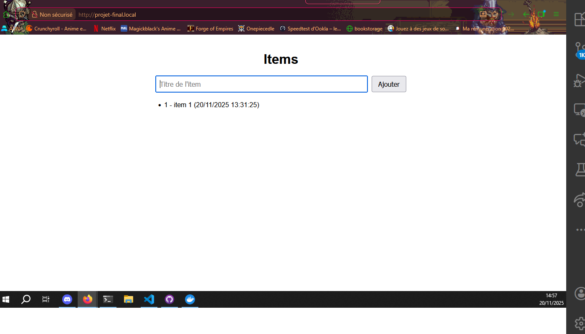
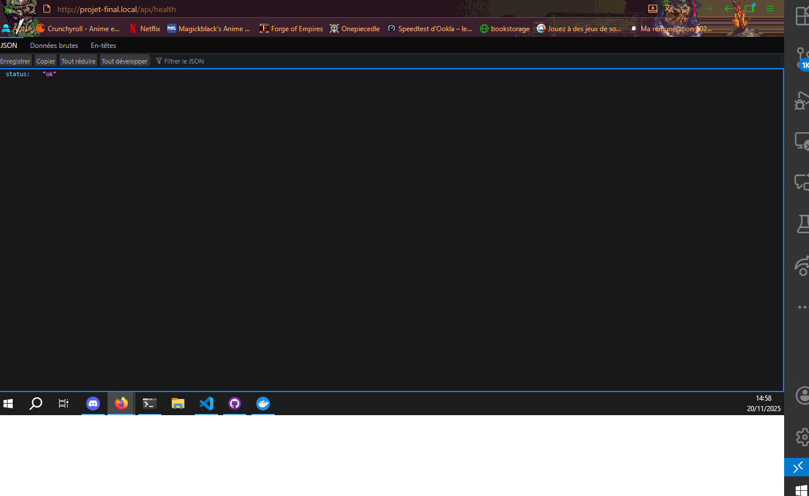
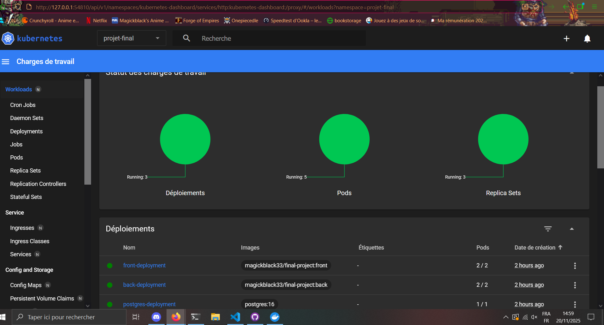

# Tp-Final

## Présentation du projet

Ce projet est une démonstration pratique de conteneurisation dans le cadre du cours de M2 à Ynov. Il met en œuvre des concepts avancés pour créer, déployer et gérer des conteneurs dans un environnement de développement.

## Documentation

Pour plus de détails, consultez les fichiers suivants :
- [Installation](./docs/installation.md) : Instructions pour installer et configurer le projet.
- [Utilisation](./docs/utilisation.md) : Guide pour utiliser les fonctionnalités du projet.
- [Architecture](./docs/architecture.md) : Description de l'architecture technique.

## Screenshots

