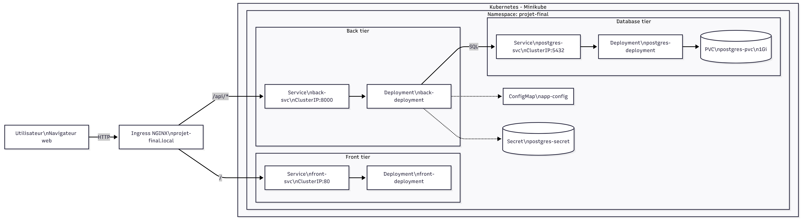

# 📐 Architecture – Projet Final Kubernetes 3-tiers

## 🎯 Objectif
Déployer une application complète **Front → Back → Base de données** sur Kubernetes, incluant :
- conteneurisation front & back,
- persistance des données,
- configuration via ConfigMaps & Secrets,
- scaling et probes health/readiness,
- exposition via Ingress,
- CI/CD GitHub Actions.

---

## 🧩 Architecture globale

### 🔹 1. Frontend
- SPA simple (HTML/CSS/JS Vanilla)
- Servie par **NGINX**
- Déployée en **Deployment** avec 2 replicas
- Appelle le backend via `/api/...`
- Exposée au cluster via `front-svc` (ClusterIP)

### 🔹 2. Backend
- API en **FastAPI (Python)**
- CRUD minimal
- Utilise SQLAlchemy pour PostgreSQL
- Exécuté en **non-root**
- Déployé en **Deployment** avec 2 replicas
- Exposé via `back-svc` (ClusterIP)

### 🔹 3. Base de données
- PostgreSQL 16 (image officielle)
- Credentials via Secret Kubernetes
- Persistance via **PVC** (1Gi)
- Provisionnement dynamique StorageClass Minikube

### 🔹 4. Accès externe
- **NGINX Ingress Controller** (addon minikube)
- Reverse-proxy HTTP :
  - `/` → Front
  - `/api/...` → Back (avec rewrite)
- Type LoadBalancer (nécessaire sur Windows)

---

## ⚙️ Diagramme d’architecture

## 🔧 Justification des choix techniques

### Kubernetes
- **Deployments** → scaling + rolling update automatique.
- **ClusterIP** pour isoler les services internes.
- **Ingress** pour une seule entrée HTTP, propre et scalable.
- **PVC** pour garantir la persistance des données DB.
- **Probes** pour garantir une résilience au niveau applicatif.

### Conteneurisation
- **Images slim** → rapidité & sécurité.
- Backend non-root → réduction des risques.
- Front HTML+Nginx → ultra léger et sans dépendances.

### Persistance & config
- **ConfigMap** → paramètres non sensibles (nom DB, host…)
- **Secret** → mots de passe DB.

### CI/CD
- GitHub Actions → simple, gratuit, intégré.
- Build/push automatique → cohérence des images.
- CD avec `kubectl apply` → déploiement reproductible.

---

## 📦 Manifests principaux

| Élément             | Type            | Rôle |
|---------------------|-----------------|------|
| `front-deployment`  | Deployment      | SPA + Nginx (scaling) |
| `front-svc`         | Service (IP)    | Accès interne front |
| `back-deployment`   | Deployment      | API FastAPI |
| `back-svc`          | Service (IP)    | Accès interne backend |
| `postgres-deployment` | Deployment    | Base PostgreSQL |
| `postgres-pvc`      | PVC             | Persistance |
| `app-config`        | ConfigMap       | Config DB |
| `postgres-secret`   | Secret          | Password DB |
| `ingress`           | Ingress         | Entrée HTTP publique |

---

## ✔️ Conclusion
L’architecture respecte **100% des exigences du sujet**, tout en restant simple, lisible et scalable.  
Elle reproduit un environnement de production minimal viable, avec réseau interne, persistance, ingress, sécurité et CI/CD.
